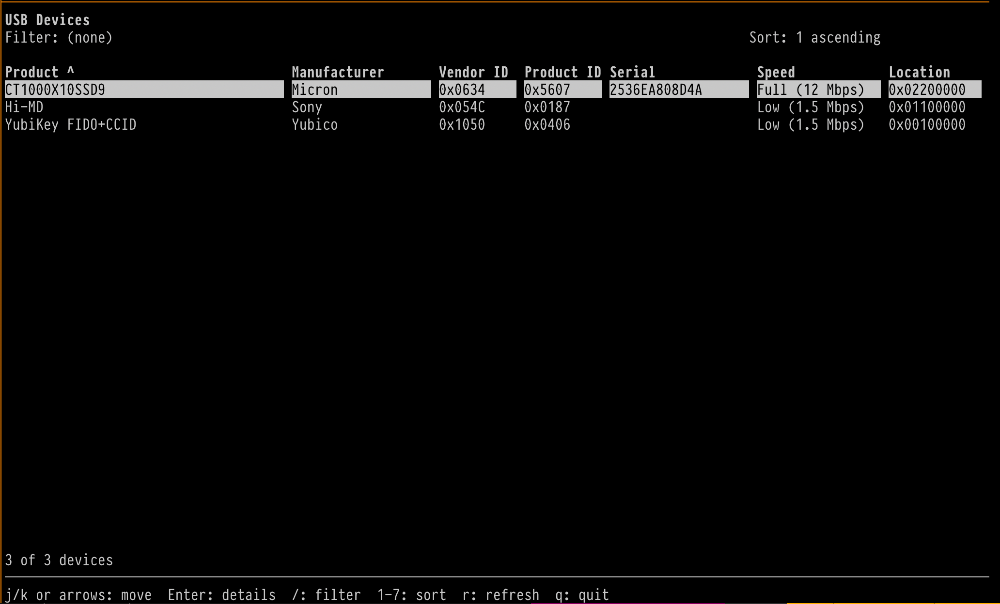

# usb-tui

A keyboard-driven terminal browser for connected USB devices on macOS. It uses
C, ncurses, and IOKit, and builds with standard Makefiles on macOS and with GNU Make.



## Build and run

```sh
make
./usb-tui
```

The build uses the system IOKit and CoreFoundation frameworks and ncurses. Set
`MACOSX_DEPLOYMENT_TARGET=10.11` when compiling with a toolchain and SDK that
support El Capitan, for example:

```sh
make clean
MACOSX_DEPLOYMENT_TARGET=10.11 make
```

The available Xcode SDK determines the actual deployment floor. Runtime
support on macOS 10.11 still needs to be verified on an El Capitan Mac.

## Keys

- Up/down arrows or `j`/`k`: move through devices
- Enter: show details
- `/`: enter a filter
- `1` through `7`: sort by a column; press the same number again to reverse
- `r`: refresh USB devices
- `q`: quit

USB enumeration currently uses the macOS IOKit backend. The terminal UI is
kept separate from that backend so other operating systems can be added later.
